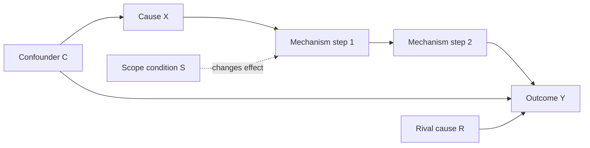
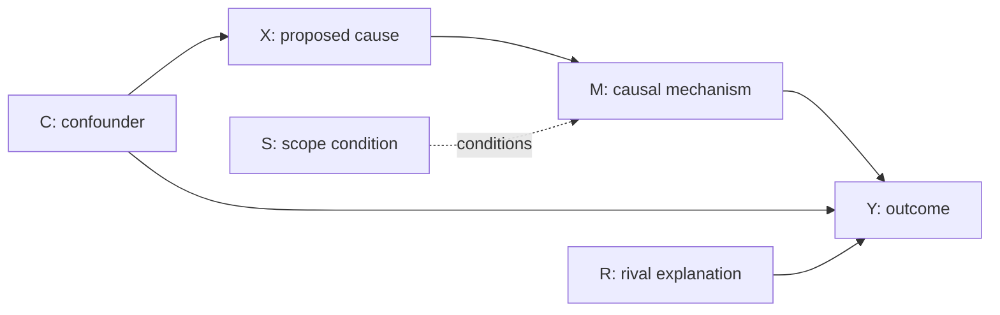

# Causal Explanation And Hypotheses

Use this file when a user needs to build a causal explanation, clarify variable relations, draw a causal diagram, form research hypotheses, compare rival explanations, or revise the theory section of an IR/political science paper.

This is a paraphrased and expanded methodological guide based on the book chapter on constructing causal explanations. Do not reproduce the book's wording. Turn the ideas into research-design artifacts.

## Chapter Logic

The chapter's practical sequence is:

1. **明确因果关系**: define what it means to say X causes Y, and distinguish causal relation from mere correlation or description.
2. **图解因果关系**: use diagrams to clarify variables, mechanisms, confounders, mediators, colliders, and the conditions under which comparison is meaningful.
3. **构建因果解释**: explain why and how the cause produces the outcome through an explicit mechanism.
4. **提出因果假设**: translate explanation into testable propositions and observable implications.
5. **修改因果假设**: revise vague, unfalsifiable, overbroad, or empirically unsupported hypotheses into sharper forms.

## 1. What Counts As A Causal Explanation

A causal explanation answers **why Y occurs, changes, varies, or differs across cases**. It is not enough to say that two phenomena appear together.

A complete causal explanation should specify:

| Element | Question To Answer | Common Output |
|---|---|---|
| Outcome Y | What exactly needs explaining? | A clear dependent variable |
| Cause X | What factor is expected to produce or change Y? | An independent variable |
| Mechanism M | Through what process does X affect Y? | A stepwise causal chain |
| Scope S | Under what conditions should the relation hold? | Case, time, actor, institutional or structural boundary |
| Rival R | What else could explain Y? | Competing hypotheses |
| Observable O | What evidence should appear if the explanation is right? | Traces, patterns, documents, behaviors, data |

Do not accept "X influences Y" as a finished explanation. Ask:

- What is the outcome and how does it vary?
- What is the proposed cause and when does it occur?
- What changes first, and what changes after that?
- Which actor's incentives, beliefs, capabilities, information, or constraints change?
- What evidence would be visible if this mechanism operated?
- What other explanations would produce the same outcome?

## 2. From Research Question To Causal Question

Many topics are descriptive at first. Convert them into causal questions.

| Weak Form | Causal Form |
|---|---|
| "Study China's global governance participation" | Why did China's participation in a specific governance field increase, decline, or change form during a specific period? |
| "Analyze alliance politics in East Asia" | Why did some states strengthen alliance cooperation while others hedged under similar security pressure? |
| "Discuss international organizations and conflict" | Under what conditions do regional organizations reduce conflict escalation? |
| "Examine technology competition" | How does export-control pressure change the target state's industrial policy choices? |

Good causal questions usually ask:

- **Why Y?** Why did an outcome occur?
- **Why variation?** Why did Y occur in some cases but not others?
- **Why change?** Why did the same actor behave differently over time?
- **How?** Through what mechanism did X produce Y?
- **Under what conditions?** When is X likely or unlikely to produce Y?

## 3. Causal Relation Is Not Correlation

Correlation is useful but insufficient. A causal claim requires a plausible ordering and a mechanism.

### Minimum Criteria

- **Covariation**: X and Y vary together in a meaningful pattern.
- **Temporal order**: X occurs before Y, or before the relevant change in Y.
- **Non-spuriousness**: the relation is not mainly produced by a third factor.
- **Mechanism**: there is a credible process linking X to Y.
- **Counterfactual plausibility**: if X had been absent or different, Y would likely have been different.

### Common Confusions

- A trend is not a cause.
- A background condition is not necessarily the decisive cause.
- A concept label is not a mechanism.
- A case narrative is not automatically a causal explanation.
- Statistical association does not by itself show the mechanism.
- Strong plausibility does not remove the need for rival explanations.

## 4. Variable Relationship Types

Use variables to clarify what is being compared and explained.

| Role | Meaning | Diagnostic Question |
|---|---|---|
| Independent variable X | Proposed cause | What changes the outcome? |
| Dependent variable Y | Outcome to explain | What varies across cases or over time? |
| Mediating variable M | Process transmitting X's effect | Through what intermediate step does X affect Y? |
| Moderating/scope variable S | Condition changing the strength or direction of X's effect | When does X matter more or less? |
| Confounder C | Factor affecting both X and Y | Could C create a false X-Y relationship? |
| Collider K | Common effect of X and another factor | Would controlling for K create bias? |
| Control variable | Variable accounted for to isolate X-Y relation | Why should this be controlled, and what bias does it reduce? |

### Mediator

A mediator is part of the causal chain. If the goal is to estimate or explain the total effect of X on Y, do not casually control for the mediator.

```text
X -> M -> Y
```

Example pattern:

```text
External threat -> elite threat perception -> alliance tightening
```

### Moderator Or Scope Condition

A moderator changes when or how strongly X affects Y.

```text
X -> Y
S changes the strength/direction of X -> Y
```

Example pattern:

```text
Economic dependence reduces conflict risk mainly when political trust is not collapsing.
```

### Confounder

A confounder affects both X and Y, making the apparent relation potentially spurious.

```text
C -> X
C -> Y
X -> Y ?
```

Example pattern:

```text
Historical hostility may affect both alliance choice and conflict probability.
```

### Collider

A collider is a common effect. Conditioning on it can create a misleading relationship.

```text
X -> K <- Z
```

Example pattern:

```text
Studying only crises that became highly publicized may distort the relation between leadership style and escalation, because publicity can be caused by both.
```

## 5. Causal Diagram Template

Use diagrams before writing prose. They expose missing variables, circular logic, and bad controls.



When producing a diagram for a user, also write a one-paragraph interpretation:

```text
This explanation argues that X changes [actor]'s [belief/incentive/capability/constraint], which leads to [behavior]. That behavior changes [interaction/institution/distribution], and this produces Y. The argument is expected to hold under S. R is the main rival explanation.
```

## 6. Causal Mechanism

A causal mechanism is the process through which a cause produces an outcome. In IR research, mechanisms often work through actors' perceptions, incentives, constraints, resources, institutions, identities, or strategic interaction.

### Mechanism Checklist

A good mechanism should:

- identify actors, not only structures;
- specify the relevant incentive, belief, capability, information, norm, or institutional constraint;
- show temporal order;
- connect each step with a reason;
- generate observable traces;
- distinguish itself from rival mechanisms;
- avoid assuming the outcome inside the explanation.

### Mechanism Building Formula

```text
X changes actor A's [belief / incentive / capability / information / constraint / identity].
Because of this change, A chooses [strategy or behavior].
That behavior alters [interaction pattern / institutional rule / distribution of resources / credibility / bargaining range].
The altered condition produces Y.
```

### Mechanism Types In IR

| Mechanism Type | Core Logic | Typical Evidence |
|---|---|---|
| Power-distribution mechanism | Changes in relative capability alter threat, bargaining leverage, or balancing behavior | capability data, defense policy, alliance moves, elite assessments |
| Security-dilemma mechanism | Defensive measures are interpreted as offensive threats, producing spirals | military deployments, threat narratives, signaling failures |
| Credibility/commitment mechanism | Actors doubt promises or threats because future incentives differ | negotiation records, alliance commitments, audience costs, enforcement design |
| Domestic-politics mechanism | Internal coalitions, regime survival, public opinion, or bureaucratic politics shape external behavior | party debates, elite speeches, interest-group pressure, bureaucratic documents |
| Institutional mechanism | Rules, monitoring, information, or enforcement alter actor behavior | treaty design, voting rules, compliance reports, dispute-settlement records |
| Norm/identity mechanism | Shared ideas define appropriateness, legitimacy, or role expectations | discourse, identity claims, norm diffusion, socialization evidence |
| Economic-interdependence mechanism | Trade, finance, supply chains, or sanctions alter costs and preferences | trade data, firm lobbying, sanctions records, investment flows |
| Learning mechanism | Past experience updates beliefs and policy repertoires | policy reviews, memoirs, lessons-learned documents, doctrinal shifts |
| Path-dependence mechanism | Early choices create increasing returns or lock-in | sequencing evidence, sunk costs, institutional inertia |

## 7. Constructing Causal Explanation

### Step 1: Define Y First

Start from the outcome, not from the favorite theory.

Bad:

```text
This paper studies whether institutions matter.
```

Better:

```text
This paper explains why ASEAN mediation reduced escalation in case A but failed in case B.
```

### Step 2: Identify Variation

Ask what kind of variation is being explained:

- occurrence vs non-occurrence;
- high vs low level;
- increase vs decrease;
- success vs failure;
- different policy choices;
- different timing;
- different intensity.

### Step 3: Select Candidate X

A useful X should:

- precede Y;
- plausibly vary across cases or time;
- not be identical to Y;
- connect to existing theoretical debate;
- be observable or operationalizable.

### Step 4: Build The Mechanism

Write the mechanism in 3-5 linked steps. Each step should answer "why does the next step follow?"

### Step 5: Define Scope

No causal explanation applies everywhere. Specify:

- actor type: great powers, small states, international organizations, leaders, firms, armed groups;
- system condition: war, crisis, transition, unipolarity, multipolarity;
- institutional condition: high/low legalization, monitoring, enforcement;
- domestic condition: regime type, coalition structure, public pressure;
- temporal boundary: before/after a reform, crisis, war, or leadership change.

### Step 6: Add Rival Explanations

Rivals sharpen the theory. At minimum, include one strong rival that could plausibly explain the same Y.

### Step 7: Derive Observable Implications

Observable implications are the bridge between theory and evidence. They say what should be seen if the mechanism is true.

Examples:

- If threat perception is the mediator, documents should show threat assessment changing before policy change.
- If domestic coalition pressure is the mechanism, lobbying or legislative pressure should precede policy shift.
- If institutional monitoring matters, compliance should improve after monitoring rules become more precise, not merely after treaty signing.

## 8. Counterfactual Thinking

Causal inference depends on asking what would likely have happened if X had been absent or different. In case studies this appears as a disciplined "thought experiment."

### Use Counterfactuals To Ask

- If X had not occurred, would Y still have occurred?
- If X had been weaker/stronger, would Y have changed in degree?
- If the rival cause R had been absent, would Y still be explained?
- Which nearby case or period approximates the counterfactual comparison?

### Good Counterfactuals

- change only one key factor as much as possible;
- remain historically plausible;
- use a close comparison case or period;
- explain why alternative outcomes would follow;
- do not become pure speculation.

## 9. Comparability In Causal Analysis

Comparison is meaningful only when cases are comparable for the purpose of the causal claim.

### Causal Comparability Means

- the cases share enough background conditions to make the contrast interpretable;
- the dependent variable differs or changes in a way that needs explanation;
- key confounders are controlled by design or reasoning;
- the proposed mechanism can plausibly operate in all compared cases;
- evidence is available for both positive and negative cases.

### Comparison Strategies

| Strategy | Use When | Risk |
|---|---|---|
| Same case over time | Explaining policy change, crisis turning point, institutional shift | Other events may change at the same time |
| Most-similar cases | Cases are similar except for X and Y | Hidden differences may still matter |
| Most-different cases | Cases differ broadly but share X and Y | Mechanism may not be the same |
| Positive-negative comparison | One case has Y, another does not | Negative case evidence is often thin |
| Within-case process tracing | Mechanism is more important than broad generalization | Can become narrative if not tied to observable implications |

## 10. From Theory To Hypothesis

A hypothesis is a testable causal proposition derived from the explanation. It should be more precise than a viewpoint and less abstract than a theory.

### Hypothesis Components

| Component | Requirement |
|---|---|
| X | Clear independent variable |
| Y | Clear dependent variable |
| Direction | stronger/weaker, more/less likely, increase/decrease |
| Scope | where and when it applies |
| Mechanism | short causal reason |
| Evidence | observable implication or test condition |

### Strong Hypothesis Forms

```text
H1: Under S, the stronger X is, the more likely Y becomes, because M.
H2: When S is absent, the effect of X on Y weakens or disappears.
H3: If mechanism M is correct, we should observe O1 before O2, followed by O3.
H4: Compared with cases lacking X, cases with X should show Y through the specific mechanism M.
```

### Weak Hypothesis Forms To Revise

| Weak Form | Problem | Better Form |
|---|---|---|
| "International organizations matter." | No X, Y, direction, or evidence | "When an organization has monitoring authority, member compliance is more likely because information asymmetry decreases." |
| "Power affects foreign policy." | Too broad | "When perceived relative power declines, leaders are more likely to pursue alliance reinforcement because bargaining uncertainty rises." |
| "Identity explains cooperation." | Concept too vague | "When elites define another state as part of the same security community, they are more likely to accept costly cooperation because defection is interpreted as less likely." |
| "Sanctions cause resistance." | Direction and mechanism underspecified | "When sanctions threaten regime survival, targeted governments are more likely to mobilize nationalist resistance because concession becomes domestically costly." |

## 11. Main And Rival Hypotheses

Do not only write a favorite hypothesis. Pair it with rivals.

| Relationship | Meaning | Example |
|---|---|---|
| Direct rival | R explains Y instead of X | Domestic politics, not external threat, explains policy change |
| Conditional rival | X matters only under condition S | Institutions matter only when enforcement is credible |
| Mechanism rival | X affects Y, but through a different path | Sanctions work through elite splits, not economic pain |
| Scope rival | Explanation works in one domain but not another | Norms matter in humanitarian issues but not core security issues |
| Null rival | X has no meaningful effect | Observed change is due to background trend or chance |

### Rival Explanation Inventory

Use this list to avoid a narrow theory section:

- power distribution;
- threat perception;
- economic interdependence;
- domestic regime type;
- elite coalition and bureaucratic politics;
- leader belief or misperception;
- ideology, identity, or norm;
- institutional design and enforcement;
- international law and legitimacy;
- geography and regional security environment;
- historical path dependence;
- technological change;
- external shock or crisis.

## 12. Observable Implications

Hypotheses become testable through observable implications.

### Three Kinds

| Kind | Question | Example |
|---|---|---|
| Pattern implication | What cross-case or time pattern should appear? | Higher monitoring precision should correlate with higher compliance |
| Sequence implication | What should happen first, second, third? | Threat assessment shifts before alliance policy changes |
| Trace implication | What documentary or behavioral trace should exist? | Internal memoranda discuss credibility concerns before signaling changes |

### Evidence Chain

For each hypothesis, ask:

1. What must be true before X?
2. What should happen immediately after X?
3. What should appear inside the mechanism?
4. What evidence would show Y was produced by this mechanism rather than by R?
5. What evidence would make the hypothesis fail?

## 13. Modification Of Hypotheses

Revise hypotheses when they are too vague, too broad, circular, untestable, or inconsistent with the mechanism.

### Revision Rules

- Add a dependent variable if the statement only names a topic.
- Add direction if the statement only says "related to."
- Add scope if the claim is universal.
- Add mechanism if the claim jumps from X to Y.
- Add observable implications if the claim cannot be tested.
- Remove tautology if X already contains Y.
- Split one large claim into several smaller hypotheses if multiple mechanisms are mixed.

### Before And After

```text
Before: Great-power competition affects international organizations.
After: When great-power competition intensifies, international organizations are less likely to reach binding decisions in security-related issue areas, because member states become less willing to reveal information and delegate authority.
```

```text
Before: Nationalism leads to conflict.
After: When ruling elites frame territorial disputes as tests of national dignity, compromise becomes less likely because concession raises domestic audience costs.
```

## 14. Common Inference Risks

| Risk | Description | Fix |
|---|---|---|
| Circular explanation | X is defined by Y | Define X independently of the outcome |
| Endogeneity | X and Y influence each other | Clarify timing; consider feedback loops |
| Omitted variable | A third factor explains both X and Y | Add rival/confounder and control strategy |
| Selection bias | Cases selected only because Y occurred | Include negative or comparison cases |
| Over-control | Controlling for mediator removes the mechanism | Distinguish mediator from confounder |
| Collider bias | Conditioning on a common effect creates false relation | Avoid controlling for colliders |
| Mechanism gap | Theory jumps from X to Y | Add actor-level steps |
| Conceptual stretching | Claim applies beyond its valid scope | Narrow scope conditions |
| Evidence cherry-picking | Only supportive facts are used | Specify disconfirming evidence |

## 15. Output Patterns

### A. Causal Explanation Table

| Element | Draft |
|---|---|
| Research puzzle | |
| Research question | |
| Outcome Y | |
| Variation in Y | |
| Cause X | |
| Mechanism M | |
| Scope condition S | |
| Rival explanation R | |
| Observable implication O | |
| Main inference risk | |

### B. Mechanism Chain

```text
X:
Actor affected:
Step 1:
Step 2:
Step 3:
Outcome Y:
Scope:
Observable traces:
Rival explanation:
```

### C. Hypothesis Set

| Type | Hypothesis | Observable Implication | Rival |
|---|---|---|---|
| Main H1 | | | |
| Mechanism H2 | | | |
| Scope H3 | | | |
| Rival H4 | | | |

### D. Causal Diagram Prompt

When asked to help the user, produce a diagram and then explain it:



## 16. Response Rule For This Skill

When the user asks for causal explanation or hypotheses:

1. Start from Y and the variation to explain.
2. Ask for or infer X only after Y is clear.
3. Write the mechanism as a chain, not as a label.
4. Add scope conditions and rivals.
5. Convert the mechanism into hypotheses.
6. Add observable implications and disconfirming evidence.
7. Warn when the claim is descriptive, circular, unfalsifiable, or overbroad.

