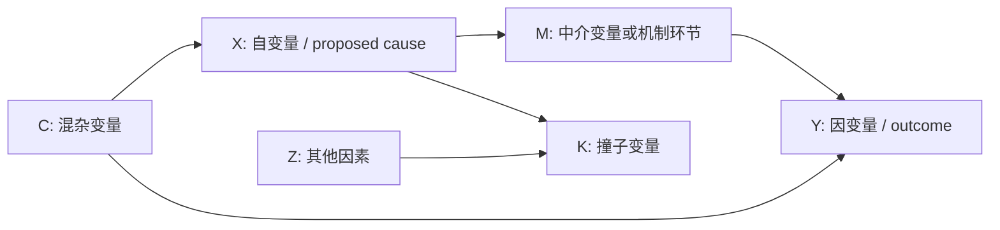

# Causal Explanation And Hypotheses

Use this file when a user needs to build or revise the causal-explanation and hypothesis section of an international relations / political science research design.

This file is an OCR-assisted, paraphrased, agent-oriented synthesis of Chapter 5, "构建因果解释", from the source book. It is not a verbatim reproduction. Use it to produce research-design artifacts: causal diagrams, mechanism chains, hypotheses, counterfactual comparisons, and revision checklists.

## Source Alignment Notes

Be careful about which concepts are directly from the book and which are agent-facing operational additions.

| Term / Element | In the book? | How to use in this skill |
|---|---|---|
| 因果关系 | Yes | Core starting point: explain cause, outcome, and causal relation. |
| 规律性因果 / 反事实因果 / 机制性因果 | Yes | Use as the three ways to understand causal relation. |
| 自变量 X / 因变量 Y | Yes | Use as the basic notation for cause and outcome. |
| 中介变量 / mediator | Yes | Use when X affects Y through an intermediate variable. |
| 因果机制 / causal mechanism | Yes | Use to explain how entities and activities generate an outcome. |
| 混杂变量 / confounder | Yes | Use to identify a third factor that may create spurious correlation. |
| 撞子变量 / collider | Yes | Use cautiously; the book introduces it as a variable type, with control implications discussed later. |
| 因果图 / causal diagram / DAG | Yes | Use to clarify variable positions and arrows, not as a substitute for mechanism. |
| 反事实 / counterfactual | Yes | Use to ask whether Y would change if X had not occurred. |
| 因果意义上的可比性 | Yes | Use when building counterfactual or case comparisons. |
| 限界条件 / scope condition | Yes | The book explicitly uses it when discussing how to revise hypotheses after empirical anomalies; it means the applicable boundary of a causal hypothesis. |
| Scope condition S | Partly | The concept is in the book; the letter `S` is this skill's shorthand for ease of diagramming. |
| Rival cause R | Not as a fixed book term | The book does not present `R` as a formal element. This skill uses `R` to operationalize the book's emphasis on excluding spurious relations, considering other variables/factors, and handling empirical anomalies. Prefer calling it "替代解释/其他可能原因" in Chinese output. |
| 可观察含义 / observable implications | Methodological addition | The book stresses empirical testability and experience facts; this skill uses "observable implications" as an agent-facing bridge from hypothesis to evidence. |

## Chapter Structure

The chapter has three major tasks:

1. **明确因果关系**: clarify what causality means and how causal relations differ from correlation.
2. **构建因果解释**: state principles and methods for explaining why and how a cause produces an outcome.
3. **提出并修改因果假设**: turn causal explanation into testable hypotheses, then revise them when operationalization or evidence creates problems.

The chapter is not merely about "X -> M -> Y". Its logic is closer to:

```text
research question
-> define variables and causal relation
-> diagram variable positions
-> satisfy causal-explanation principles
-> build counterfactual and/or mechanism
-> form hypotheses
-> test and revise hypotheses
```

## 1. Clarify Causal Relation

Start by separating **correlation**, **causal relation**, and **causal explanation**.

### Three Understandings Of Causality

| Type | Core Idea | Typical Use |
|---|---|---|
| 规律性因果 | Cause and outcome show regular connection; X's presence or change is associated with Y's occurrence or change. | Useful for case comparison, statistical association, and identifying empirical patterns. |
| 反事实因果 | If X had been absent or different, Y would not have occurred or would have changed. | Useful for case-study "thought experiments", close comparisons, and causal-effect reasoning. |
| 机制性因果 | X produces Y through a process made of entities, activities, and generative links. | Useful for explaining how and why the outcome occurred. |

Do not treat these as mutually exclusive. A strong causal explanation often combines:

- a pattern showing X and Y are related;
- a counterfactual showing Y depends on X;
- a mechanism showing how X generates Y.

### Effects-Of-Causes And Causes-Of-Effects

Distinguish two research orientations:

| Orientation | Core Question | Output |
|---|---|---|
| Effects-of-causes | Does X affect Y, and how much? | Estimate or compare the effect of a cause. |
| Causes-of-effects | What caused this specific Y, and through what path? | Explain a particular outcome or case. |

In many IR theses, the user starts with causes-of-effects: "Why did this event/outcome happen?" Then the design still needs X/Y clarity so the explanation can be tested.

## 2. From Concepts To Variables

The book emphasizes moving from concepts to variables. A concept becomes useful for causal research only when it can vary in the research context.

### Concept, Constant, Variable

- A **concept** names a phenomenon or property.
- A **constant** does not vary in the selected research setting.
- A **variable** has more than one value in the selected research setting.

Whether something is a variable depends on the research context. A factor may be constant in a short time span and variable in a long time span.

### Independent And Dependent Variables

| Variable | Meaning | Common Error |
|---|---|---|
| 自变量 X | The proposed cause; its change is expected to produce change in another variable. | Choosing X because it is theoretically fashionable, not because it helps answer the question. |
| 因变量 Y | The outcome to be explained. | Leaving Y vague, such as "security", "order", or "cooperation" without specifying variation. |

The same concept can be X in one research question and Y in another. The role is determined by the research question, not by the concept itself.

## 3. Diagram Variable Relations

The book uses diagrams to distinguish correlation, causality, mediation, mechanism, confounding, collider relations, and causal graphs.

### Correlation Vs Causation

Correlation is directionless; causal relation has direction.

```text
Correlation: X -- Y
Causation:   X -> Y
```

Minimum causal requirements:

1. **Temporal order**: the cause appears before the outcome.
2. **Correlation / covariation**: X and Y show an observable relation.
3. **No obvious spurious relation**: the association is not mainly produced by another factor.
4. **Counterfactual and/or mechanism**: the design can show dependence or generation.

### Mediator

A mediating variable sits between X and Y. It transmits the effect.

```text
X -> M -> Y
```

Use a mediator when the user needs to answer "how does X affect Y?"

Example pattern:

```text
共同威胁 -> 共同战略利益 -> 军事同盟
```

Do not casually control for a mediator if the research goal is to explain the total effect of X on Y.

### Causal Mechanism

A causal mechanism is not just another variable. It is a connected process involving entities and activities.

```text
Entity or actor with attributes
-> activity
-> next entity/activity
-> generated outcome
```

The book's key warning: **a mechanism cannot be reduced to a variable**. Variables ask about values; mechanisms ask how entities and activities are organized and operate.

### Confounder

A confounder affects both X and Y, making the observed relation potentially spurious.

```text
C -> X
C -> Y
X -> Y ?
```

Use confounders to ask whether the proposed causal relation is actually produced by a third factor.

### Collider

A collider is a common effect of two causes.

```text
X -> K <- Z
```

The book introduces collider variables as part of variable-relation diagrams. The practical implication is mainly handled in variable-control logic: conditioning on a collider can distort inference.

### Causal Diagram

Use a causal diagram to display variables and directed causal assumptions.



Do not confuse:

- causal diagram: a simplified map of variable relations;
- causal mechanism: a generative process linking entities and activities;
- theory framework: a broader argument that may include concepts, assumptions, and hypotheses.

## 4. Principles For Constructing Causal Explanation

The book presents causal explanation as requiring basic principles plus at least one key strengthening route.

### Basic Principles

| Principle | Meaning | Diagnostic Question |
|---|---|---|
| 时序性 | Cause must precede outcome. | Did X occur before Y, or before the relevant change in Y? |
| 相关性 | X and Y must show an observable relation. | Is there covariation, co-occurrence, or patterned difference? |
| 排除虚假相关 | The relation should not be created by measurement error, selection, or third factors. | What else could produce both X and Y? |

### Strengthening Routes

After temporal order and correlation, a causal explanation should use **at least one** of:

| Route | What It Does | When Useful |
|---|---|---|
| 构建反事实 | Shows that Y would differ if X were absent/different. | Case studies, close comparisons, policy-change analysis. |
| 追踪因果机制 | Shows how X generates Y through a process. | Mechanism-heavy IR explanations, process tracing, theory building. |

The strongest designs often use both.

## 5. Counterfactual Construction

Counterfactual analysis asks: if the cause had not existed, would the outcome still have occurred?

### Core Logic

```text
Observed world:        X occurs -> Y occurs
Counterfactual world:  X absent/different -> would Y still occur?
```

If Y would still occur under the counterfactual, X is not a convincing cause. If Y would plausibly change, X has causal relevance.

### The Fundamental Difficulty

The same case cannot be observed both with X and without X. Therefore the researcher needs a substitute comparison:

- same case at another time;
- a similar case;
- a carefully constructed thought experiment;
- a critical turning point where a small change plausibly alters X.

### Causal Comparability

The book stresses causal comparability: the comparison must be meaningful for the causal claim.

A counterfactual or comparison is stronger when:

- the real case and comparison case are similar on major background conditions;
- the main difference is X or a small event affecting X;
- other relevant variables are held stable or their changes are explicitly discussed;
- the counterfactual is historically plausible;
- the counterfactual generates testable implications.

### Practical Counterfactual Template

| Item | Fill In |
|---|---|
| Observed outcome Y | |
| Proposed cause X | |
| Counterfactual change | If X had been absent/weaker/stronger... |
| Expected alternative Y | |
| Why this is plausible | |
| What else might change | |
| Evidence that can test the counterfactual | |

## 6. Mechanism Construction

Mechanism construction explains why and how the cause produces the outcome.

### When Mechanism Is Especially Necessary

Use mechanism construction when:

- the case outcome is puzzling and not explained by broad correlation;
- the researcher needs to show why X actually generated Y;
- different mechanisms could connect the same X and Y;
- the project is a qualitative case study or comparative process tracing.

### Mechanism Requirements

A mechanism should specify:

- **context**: the situation in which the mechanism operates;
- **entities**: actors, institutions, groups, organizations, rules, resources;
- **attributes**: properties that make an entity capable of a certain activity;
- **activities**: actions, choices, interactions, signals, constraints;
- **sequence**: the order in which activities generate the next step;
- **productive continuity**: why one step triggers or enables the next;
- **outcome**: how the process produces Y.

### Mechanism Is Not A Timeline

A sequence of events is not automatically a mechanism. A mechanism must show generative links.

Weak:

```text
Event A happened, then event B happened, then event C happened.
```

Stronger:

```text
Event A changed actor B's incentives, which made strategy C more attractive; strategy C altered the bargaining relation and produced outcome Y.
```

### Mechanism Chain Template

```text
Context:
Entity 1:
Entity 1's relevant attribute:
Activity 1:
How Activity 1 activates Entity 2 or changes its condition:
Activity 2:
Intermediate result:
Final outcome Y:
Evidence for each link:
```

### Mechanism Diagram


## 7. Case-Study Inference Methods

The chapter links different causal understandings with case-study methods.

| Causal Understanding | Case-Study Method | Use |
|---|---|---|
| 规律性因果 | within-case comparison, congruence analysis, method of agreement, method of difference, most-similar comparison | Identify patterned association and variation. |
| 反事实因果 | controlled comparison, counterfactual case, "thought experiment" | Estimate what would happen if X were absent/different. |
| 因果机制 | comparative process tracing, within-case process tracing | Show the generative process from X to Y. |

Use the method that matches the user's causal claim. Do not use process tracing if the output only lists events. Do not use comparison if cases are not causally comparable.

## 8. From Causal Explanation To Hypothesis

The book treats causal hypothesis as the bridge between theory/causal explanation and empirical facts.

### Research Hypothesis Vs Assumption

| Item | Meaning |
|---|---|
| Research hypothesis | An untested answer to the research question; must face empirical evidence. |
| Assumption | A premise the researcher temporarily treats as true to build an argument. |

Do not write an assumption as if it were a hypothesis.

### General Requirements For A Research Hypothesis

A good research hypothesis should:

1. be clear and specific;
2. have empirical content;
3. be testable by experience facts;
4. avoid tautology;
5. connect to a broader theory or explanation.

The core requirement is testability.

### Special Requirements For A Causal Hypothesis

A causal hypothesis must also:

- identify the relevant variables;
- specify the causal relation between variables;
- indicate direction or condition where possible;
- clarify the mechanism or process by which X leads to Y;
- produce expectations that can be checked by evidence.

### Causal Hypothesis Formula

```text
H1: If / when X changes in direction D, Y is more/less likely to occur, because mechanism M operates under condition C.
```

Use "condition C" or "限界条件" only when the book's logic requires an application boundary. Do not force every hypothesis to include a scope condition if it is not yet known; instead mark it as "待确定".

## 9. Methods For Establishing Causal Hypotheses

The chapter discusses three main ways of generating hypotheses.

### A. Empirical Induction

Start with observed empirical facts, identify patterns, then propose a causal hypothesis.

```text
observe cases
-> find empirical pattern
-> infer possible cause
-> formulate causal hypothesis
-> test with other evidence
```

Use when the user has cases, archives, event data, or recurring observations but no mature theory yet.

Risk: simple enumeration can produce fragile generalizations. The pattern must be tested beyond the cases that generated it.

### B. Logical Deduction

Start from theoretical assumptions and derive hypotheses.

```text
theory / assumptions
-> logical implication
-> causal hypothesis
-> empirical test
```

Use when the user is applying a known theoretical paradigm such as realism, liberal institutionalism, constructivism, domestic politics, or bargaining theory.

Risk: if assumptions are unrealistic or hidden, the hypothesis may look elegant but fail empirically.

### C. Abductive Analysis

Start from surprising facts that existing theories do not explain, then search for a new causal hypothesis.

```text
surprising fact
-> why is this surprising?
-> possible explanatory idea
-> causal hypothesis
-> return to evidence
```

Use when the user's research puzzle is an anomaly.

The book links abduction with moving between empirical facts and theory. It also discusses retroductive thinking associated with uncovering structures and mechanisms behind observable events.

### Abduction / Retroduction Template

| Step | Question |
|---|---|
| Surprising fact | What happened that existing theory did not expect? |
| Existing expectation | What would dominant theory predict? |
| Gap | Why does the fact conflict with the theory? |
| Possible mechanism | What hidden structure or mechanism could generate the fact? |
| New hypothesis | What causal claim follows? |
| Evidence to seek | What traces would exist if the mechanism were real? |

## 10. Revising Causal Hypotheses

The book strongly warns against forcing facts to fit a favored hypothesis. If evidence does not match the hypothesis, revise honestly.

### When To Revise

Revise a hypothesis when:

- operationalization or measurement makes the hypothesis impossible to test;
- the evidence is real and directly conflicts with the hypothesis;
- the hypothesis is too broad for the observed facts;
- the mechanism cannot be found;
- the explanation survives only by ignoring anomalies.

### First Strategy: Transformation By Scope Condition

This is where the book explicitly uses **限界条件 / scope condition**.

When some evidence fits the hypothesis and other evidence conflicts with it:

1. compare fitting cases and anomalous cases;
2. identify the key difference between them;
3. turn that difference into a scope condition;
4. clarify the hypothesis's applicable range.

This strategy does not directly explain away the anomaly. It narrows the claim's range.

Template:

```text
Original H: X -> Y.
Empirical anomaly: X appears but Y does not, or Y appears without X.
Difference between expected and anomalous cases: C.
Revised H: X -> Y only when C is present / absent.
Scope condition: C.
```

### Second Strategy: Dissolution By New Explanation

When the anomaly challenges the explanation itself, revise the causal explanation so the anomaly becomes part of a new theory.

Template:

```text
Original H: X -> Y.
Anomaly: observed facts contradict H.
Revision: add or replace causal variable/mechanism.
New H: X plus Z, or Z through mechanism M, explains Y.
```

### Avoid Ad Hoc Rescue

Do not add arbitrary exceptions just to protect a theory. A scope condition is legitimate only when it identifies a meaningful difference that can be justified and tested.

## 11. What To Do With "Rival Cause R"

The book does not present a formal `Rival cause R` element. In this skill, use `R` only as a practical shorthand for:

- other variables that may produce Y;
- confounders that may create a spurious relation;
- alternative mechanisms connecting X and Y;
- empirical anomalies that the main explanation cannot handle;
- a competing theory from the literature.

In Chinese output, prefer:

```text
替代解释 / 其他可能原因 / 竞争性解释
```

instead of over-presenting `R` as a book term.

### Rival/Alternative Explanation Checklist

Ask:

- Could another cause produce the same Y?
- Could another variable produce both X and Y?
- Could the same X work through a different mechanism?
- Are there cases where X appears but Y does not?
- Are there cases where Y appears without X?
- What evidence would distinguish the main explanation from the alternative?

## 12. Agent Output Patterns

### A. Book-Aligned Causal Explanation Table

| Element | Draft |
|---|---|
| Research question | |
| Outcome / 因变量 Y | |
| Proposed cause / 自变量 X | |
| Temporal order | |
| Correlation / observed relation | |
| Possible spurious relation / 混杂因素 | |
| Counterfactual claim | |
| Causal mechanism | |
| Scope condition / 限界条件, if needed | |
| Alternative explanation / 其他可能原因 | |
| Testable hypothesis | |
| Evidence needed | |

### B. Mechanism-First Output

```text
情境:
实体与属性:
活动1:
活动2:
生成性连接:
结果Y:
可检验证据:
可能的替代解释:
```

### C. Hypothesis Revision Output

| Item | Revision |
|---|---|
| Original hypothesis | |
| Problem | operationalization issue / empirical anomaly / circularity / overbroad scope |
| Evidence creating the problem | |
| Transformation strategy | add scope condition |
| Dissolution strategy | revise causal explanation |
| Revised hypothesis | |
| New evidence needed | |

## 13. Response Rule

When using this file:

1. Do not present `Scope condition S` and `Rival cause R` as equally direct book terms.
2. Say that `scope condition / 限界条件` is in the book, especially in hypothesis revision and application-boundary logic.
3. Say that `Rival cause R` is this skill's operational shorthand for the book's broader concern with excluding spurious relations, other factors, and empirical anomalies.
4. Build causal explanations in the book's order: variable relation -> principles -> counterfactual/mechanism -> hypothesis -> revision.
5. Prefer Chinese terms for user-facing answers: 自变量、因变量、中介变量、混杂变量、撞子变量、因果机制、反事实、限界条件、经验反常、转化策略、消解策略.

