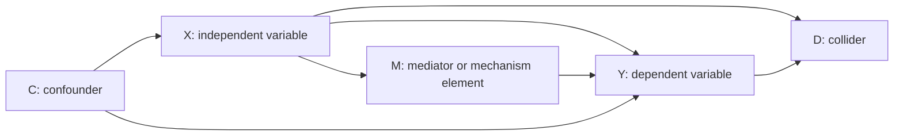

# Causal Explanation And Hypotheses

Use this file when a user needs causal diagrams, mechanisms, counterfactuals, causal hypotheses, hypothesis revision, or variable-relation clarification.

This is a paraphrased, agent-oriented synthesis of the source chapter on constructing causal explanations. It is not a verbatim reproduction.

## Source Alignment Notes

| Element | Source status | How to use |
|---|---|---|
| Causal relation | Directly source-derived | Start with cause, outcome, and relation. |
| Regularity causation | Directly source-derived | Use for patterns, covariation, and probability/regularity claims. |
| Counterfactual causation | Directly source-derived | Ask whether Y would change if X were absent or different. |
| Mechanistic causation | Directly source-derived | Explain how entities and activities generate Y. |
| Independent variable X / dependent variable Y | Directly source-derived | Use X for cause and Y for outcome. |
| Mediator M | Directly source-derived | Use for the transmission path from X to Y. |
| Confounder C | Directly source-derived | Use for a factor affecting both X and Y. |
| Collider D | Directly source-derived | In the source's Figure 5.5: X -> Y, X -> D, and Y -> D. D is the common result of X and Y. |
| Scope condition | Directly source-derived | Used when revising hypotheses after empirical anomalies; it marks the range of applicability. |
| Rival cause R | Skill shorthand, not a fixed source term | Use "alternative explanation" or "other possible cause" in user-facing output. |
| Observable implication | Methodological bridge | Use to connect hypotheses to evidence. |

## 1. Clarify Causal Relation

Separate correlation, causal relation, and causal explanation.

| Type | Core idea | Use |
|---|---|---|
| Regularity | X and Y show a patterned relation. | Identify covariation or recurring association. |
| Counterfactual | If X were absent or different, Y would be absent or different. | Build causal comparison or thought experiments. |
| Mechanism | X generates Y through entities, activities, and a process. | Explain how and why Y occurs. |

Minimum causal requirements:

1. X precedes Y.
2. X and Y show an observable relation.
3. The relation is not obviously spurious.
4. The design can support the claim through counterfactual reasoning and/or mechanism tracing.

## 2. Concepts, Constants, Variables

A concept becomes useful in causal research only when it varies in the selected research context.

- A constant does not vary in the chosen scope.
- A variable has multiple values in the chosen scope.
- The same concept can be X in one design and Y in another.
- The variable role is determined by the research question.

## 3. Diagram Variable Relations

### Correlation And Causation

```text
Correlation: X -- Y
Causation:   X -> Y
```

### Mediator

```text
X -> M -> Y
```

M transmits the effect of X to Y. Do not control for M when the goal is to explain the total effect of X on Y.

### Confounder

```text
C -> X
C -> Y
X -> Y ?
```

C may make the X-Y relation spurious.

### Collider

Use the source's Figure 5.5 pattern:

```text
X -> Y
X -> D
Y -> D
```

D is a common result of X and Y. D is not a third cause. Controlling for D can create collider stratification bias because the researcher conditions on an effect jointly produced by the variables under study.

### Causal Diagram



Do not confuse a causal diagram with a causal mechanism. A diagram maps variables and arrows; a mechanism explains the generative process.

## 4. Principles For Causal Explanation

| Principle | Diagnostic question |
|---|---|
| Temporal order | Did X occur before Y? |
| Correlation/covariation | Is there an observable relation between X and Y? |
| Excluding spurious association | Could another factor, measurement error, or selection create the relation? |
| Counterfactual and/or mechanism | Can the design show dependence or generative process? |

Diagnostic sequence:

1. Define Y and its variation.
2. Identify candidate X.
3. Check temporal order.
4. Check observed relation.
5. Identify confounders and alternative explanations.
6. Build a counterfactual comparison or a causal mechanism.
7. Convert the explanation into hypotheses.
8. Name evidence that would weaken the claim.

## 5. Counterfactual Reasoning

Counterfactual reasoning asks what would have happened if X had not occurred or had changed.

```text
Observed world: X occurs -> Y occurs
Counterfactual world: X absent/different -> would Y still occur?
```

A good counterfactual:

- changes the key cause as little as possible;
- keeps other relevant conditions stable or discusses how they change;
- remains historically plausible;
- uses a close case, a within-case period, or a critical turning point when possible;
- produces implications that evidence can still assess.

Counterfactual template:

| Item | Draft |
|---|---|
| Observed Y | |
| Proposed X | |
| Counterfactual change | |
| Expected alternative outcome | |
| Why plausible | |
| Evidence to assess it | |

Common counterfactual errors:

- Changing too many background conditions at once.
- Choosing an impossible alternative history.
- Treating speculation as evidence.
- Using a comparison case that differs on many relevant variables.
- Failing to say what observable evidence could still assess the counterfactual.

## 6. Causal Mechanism

A mechanism explains how X produces Y through entities and activities.

Mechanism components:

- context: the setting in which the process operates;
- entities: actors, institutions, organizations, rules, resources;
- attributes: properties that make an entity capable of acting;
- activities: choices, signals, constraints, interactions;
- sequence: what happens first, second, third;
- productive continuity: why one step triggers the next;
- outcome: how the process produces Y.

Mechanism template:

```text
Context:
Entity 1:
Relevant attribute:
Activity 1:
How activity 1 activates or changes entity 2:
Activity 2:
Intermediate result:
Outcome Y:
Evidence for each link:
```

## Mechanism Non-Transfer Rule

Never reuse a mechanism from an example simply because the topic sounds similar.

A mechanism must be rebuilt from the user's case:

- actors/entities;
- actor attributes;
- incentives, beliefs, resources, information, or constraints;
- actions and interactions;
- sequence;
- evidence traces.

Theory labels such as realism, institutionalism, constructivism, domestic politics, or bargaining theory may help orient the mechanism, but they do not replace the mechanism.

Mechanism quality tests:

- Entity test: Does each step identify an actor, institution, rule, resource, or organization?
- Activity test: Does each step include action or interaction, not just a noun?
- Sequence test: Is the order clear?
- Generative test: Does each step explain why the next step follows?
- Trace test: Could documents, behavior, interviews, process evidence, or data reveal the step?
- Rival test: Would a different mechanism leave different traces?

Common mechanism errors:

- Listing events without explaining the generative link.
- Calling a variable a mechanism.
- Using vague words such as "influence", "pressure", or "impact" without process.
- Skipping from macro structure directly to outcome.
- Assuming the outcome inside the mechanism.

## 7. Building Causal Hypotheses

A research hypothesis is an untested answer to the research question. It is not the same as an assumption.

A good hypothesis should:

- be clear and specific;
- have empirical content;
- be testable;
- avoid tautology;
- connect to a broader explanation.

Causal hypothesis formula:

```text
H1: When X increases/decreases or is present/absent, Y becomes more/less likely, because mechanism M operates under condition C.
```

Do not force a scope condition if it is not known. Mark it as "to be determined" when necessary.

Hypothesis strength ladder:

| Weak | Better | Strong |
|---|---|---|
| X matters. | X increases the likelihood of Y. | Under condition C, X increases the likelihood of Y because mechanism M changes actor incentives. |
| Institutions affect cooperation. | Stronger monitoring increases compliance. | When monitoring authority is delegated to an institution, compliance increases because information asymmetry and opportunism decline. |
| Threat causes alliance. | Higher perceived threat makes alliance more likely. | When leaders perceive an external threat as urgent and credible, alliance formation becomes more likely because expected security benefits outweigh autonomy costs. |

## 8. Generating Hypotheses

| Method | Logic | Risk |
|---|---|---|
| Empirical induction | Observe cases -> identify pattern -> propose hypothesis. | Fragile generalization from too few cases. |
| Logical deduction | Start from theory/assumptions -> derive hypothesis. | Elegant but empirically weak if assumptions are hidden or unrealistic. |
| Abduction | Start from surprising facts -> infer a possible explanation. | May become speculative without evidence. |

Abduction template:

| Step | Question |
|---|---|
| Surprising fact | What happened that existing theory did not expect? |
| Existing expectation | What should have happened? |
| Gap | Why is the fact puzzling? |
| Possible mechanism | What hidden process could generate it? |
| New hypothesis | What causal claim follows? |
| Evidence to seek | What traces should exist? |

## 9. Revising Hypotheses

Revise a hypothesis when operationalization fails, evidence contradicts the claim, the mechanism cannot be found, or the claim is too broad.

### Transformation Strategy: Add Scope Condition

Use when some evidence fits the hypothesis and some evidence is anomalous.

```text
Original H: X -> Y.
Anomaly: X appears but Y does not, or Y appears without X.
Key difference: C.
Revised H: X -> Y only when C is present/absent.
Scope condition: C.
```

### Dissolution Strategy: Revise Explanation

Use when the anomaly challenges the explanation itself.

```text
Original H: X -> Y.
Anomaly: observed facts contradict H.
Revision: add or replace the causal variable/mechanism.
New H: Z or X+Z produces Y through mechanism M.
```

Avoid ad hoc rescue. A scope condition is legitimate only when it identifies a meaningful, testable boundary.

Revision diagnostics:

- Is the problem conceptual, because X or Y is poorly defined?
- Is the problem operational, because the indicator cannot measure the concept?
- Is the problem empirical, because evidence contradicts the hypothesis?
- Is the problem theoretical, because the mechanism is wrong or incomplete?
- Is the anomaly a reason to narrow scope or rebuild the explanation?

Ad hoc warning signs:

- The new condition is added only after seeing the evidence.
- The condition cannot be independently measured.
- The revised claim explains every possible outcome.
- The revision protects the conclusion rather than improving the theory.

## Output Table

| Element | Draft |
|---|---|
| Research question | |
| Outcome Y | |
| Cause X | |
| Temporal order | |
| Observed relation | |
| Confounder C | |
| Mediator/mechanism M | |
| Collider D, if relevant | |
| Counterfactual claim | |
| Scope condition | |
| Alternative explanation | |
| Testable hypothesis | |
| Evidence needed | |
