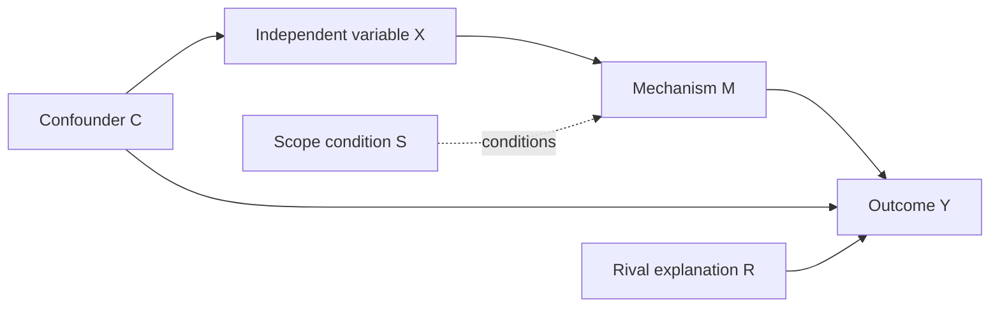

# Causal Explanation And Hypotheses

Use this file when a user needs theory building, variable relations, causal diagrams, mechanisms, or hypotheses.

## Causal Relation

A causal explanation should specify:

- **Cause X**: the factor expected to affect the outcome.
- **Outcome Y**: the phenomenon to be explained.
- **Mechanism M**: the process connecting X to Y.
- **Scope condition S**: when/where the relation is expected to hold.
- **Rival explanations R**: other plausible causes.
- **Observable implications O**: what evidence should appear if the explanation is true.

Do not accept "X influences Y" as a complete explanation. Ask "how, through what steps, under what conditions, compared with what alternative?"

## Variable Roles

Distinguish common roles:

- **Independent variable**: proposed cause.
- **Dependent variable**: outcome to be explained.
- **Mediating variable**: transmits the effect from X to Y.
- **Moderating/scope variable**: changes strength or direction of the X-Y relation.
- **Confounder**: affects both X and Y, creating a false or biased relation.
- **Collider**: a common effect of two variables; controlling for it can create bias.
- **Control variable**: factor held constant or accounted for to isolate the relation of interest.

## Causal Mechanism

A mechanism is a chain of events or processes. A strong mechanism:

- Identifies actors and incentives/beliefs/capabilities.
- Shows temporal order.
- Links each step logically.
- Produces observable traces.
- Explains why the outcome follows rather than merely co-occurs.

Template:

```text
X changes actor A's [belief/incentive/capability/information].
This leads A to choose [behavior].
That behavior changes [interaction/institution/distribution].
The changed condition produces Y.
```

## Causal Diagram Template

Use text or Mermaid:



## Building Hypotheses

A hypothesis translates an explanation into a testable statement. It should specify:

- Direction: increase/decrease, presence/absence, stronger/weaker.
- Unit: who or what changes.
- Condition: when/where the relation holds.
- Observable implication: what evidence would support or weaken it.

Forms:

- "When X increases, Y is more likely to occur, because M."
- "Under condition S, X has a stronger effect on Y."
- "If mechanism M is correct, we should observe O1, O2, and O3."

## Rival Hypotheses

Always include rival explanations. They make the research design sharper:

- Structural rival: distribution of power, geography, economic interdependence.
- Domestic rival: regime type, public opinion, elite coalition, bureaucratic politics.
- Ideational rival: identity, norm, ideology, threat perception.
- Institutional rival: treaty design, organizational rules, enforcement mechanisms.
- Historical rival: path dependence, prior conflict, colonial legacy.

## Common Errors

- Mistaking a concept for a variable: "national interest" needs dimensions and indicators.
- Mistaking correlation for mechanism: co-movement is not explanation.
- Failing temporal order: the cause must plausibly precede the outcome.
- Omitting rival explanations: the main explanation becomes unfalsifiable.
- Overstating scope: one case cannot support universal claims without careful logic.
- Controlling the mechanism away: do not control for a mediator if the goal is total effect.

## Output Pattern

When helping a user, produce:

| Element | Draft |
|---|---|
| Puzzle | |
| Research question | |
| Outcome Y | |
| Cause X | |
| Mechanism | |
| Scope condition | |
| Hypothesis | |
| Rival explanations | |
| Observable evidence | |
| Main inference risk | |
